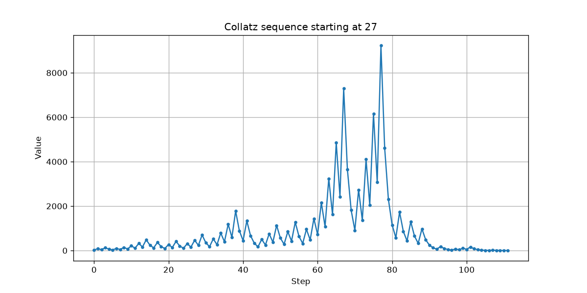
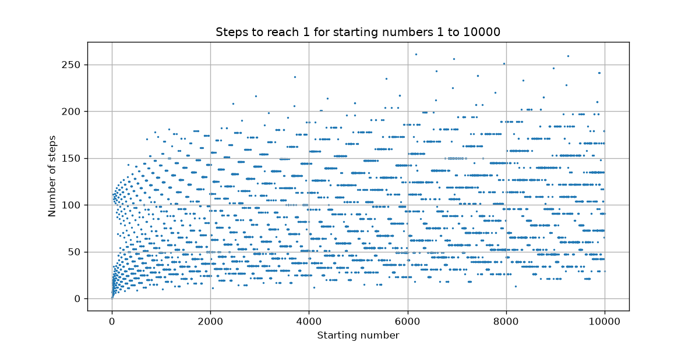
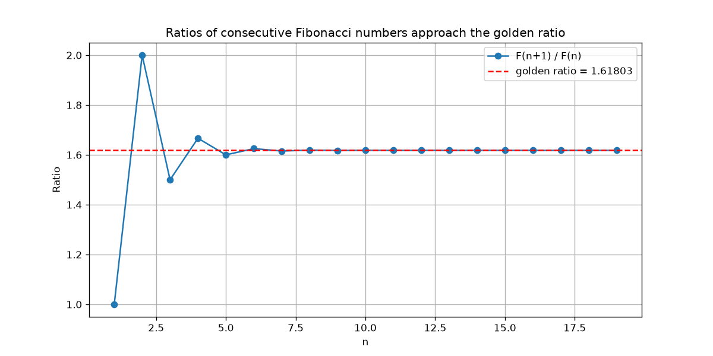

# Maths Explorations

Small Python programs exploring two ideas in number theory: the **Collatz conjecture**
and the link between the **Fibonacci sequence and the golden ratio**.

## 1. The Collatz conjecture (`collatz.py`)

Take any positive whole number and apply this rule over and over:

- if it is **even**, halve it
- if it is **odd**, multiply by 3 and add 1

The Collatz conjecture says you always end up at 1. It has been checked by computer
for huge numbers, but it has **never been proved**.

Starting at 27, the sequence climbs as high as 9232 before falling back to 1,
taking 111 steps:



Checking every starting number from 1 to 10,000, all of them reach 1. The slowest
is **6171**, which takes **261 steps**:



**What I noticed:** the number of steps jumps around unpredictably, but the points
form visible bands and curves. Neighbouring numbers often take exactly the same
number of steps, because their sequences quickly merge.

## 2. Fibonacci and the golden ratio (`fibonacci.py`)

The Fibonacci sequence starts 1, 1 and each number is the sum of the two before it:
1, 1, 2, 3, 5, 8, 13, 21, ...

Dividing each number by the one before it gives ratios that approach the
golden ratio, φ = (1 + √5) / 2 ≈ 1.6180339887:



**What I noticed:** the ratios alternate above and below φ, and each one is
roughly 2.6 times closer than the one before (2.6 ≈ φ²). By n = 19 the ratio
matches φ to 7 decimal places.

## In simple terms

Not a maths person? Here is the short version.

**The Collatz game.** Pick any number. If it's even, cut it in half. If it's odd,
triple it and add one. Keep going. For example, starting at 6:

6 → 3 → 10 → 5 → 16 → 8 → 4 → 2 → 1

Every number anyone has ever tried ends up at 1, but some take a very long,
bumpy route to get there. Nobody knows *why* this always happens, or whether it
might fail for some gigantic number no one has tested. It is one of the most
famous unsolved puzzles in maths. My program plays the game for thousands of
numbers and draws graphs of how long each one takes.

**Fibonacci and the golden ratio.** Start with 1 and 1, then keep adding the last
two numbers together: 1, 1, 2, 3, 5, 8, 13, 21, ... Now divide each number by the
one before it: 8 ÷ 5 = 1.6, 13 ÷ 8 = 1.625, 21 ÷ 13 ≈ 1.615. The answers
wobble, but they settle down on one special number, about 1.618, called the
**golden ratio**. It shows up in art, architecture and nature, such as the
spirals in sunflower heads. My program calculates these divisions and draws a
graph showing them closing in on 1.618.

## How to run it

You need Python 3 installed.

```
pip install -r requirements.txt
python collatz.py
python fibonacci.py
```

The requirements file will just download matplotlib so that the graohs can be presented
The graphs are saved in the `images` folder.

## Ideas for next steps

- Record the highest number each Collatz sequence reaches, not just the step count
- Try variations of the rule, such as 5n + 1, and see whether they still reach 1
- Prove that the Fibonacci ratios approach φ, using the equation φ² = φ + 1
